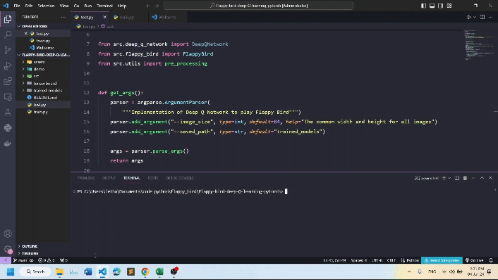

  <h1>Deep Q-learning for playing Flappy Bird 🐥</h1>

## Introduction

Here is my python source code for training an agent to play flappy bird. It could be seen as a very basic example of Reinforcement Learning's application.

   
  <i>Result</i>

## How to use my code

With my code, you can:
* **Train your model from scratch** by running `python train.py`
* **Test your trained model** by running `python test.py`

## Trained models

You could find my trained model at `trained_models/flappy_bird`
 
## Requirements

* **python 3.12**
* **pygame**
* **cv2**
* **pytorch** 
* **numpy**
